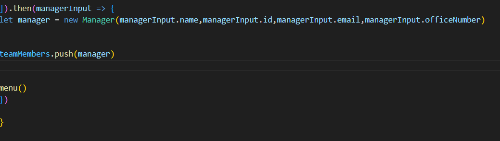

# profile-generator

## Description

In this task i created an application that took in information about employees and then generated an HTML webpage that creates a summary for each person.

1. I started by creating classes for employees and then extended them into three different roles.

2. i used inqurier to prompt questions for the user and once that was completed the information is pushed to an array as an object.

3. After each set of questions the function menu would run to prompt the user to choice if they wanted to add more employees or if the were finished

4. If the user was finished it would run a function the would generate an html file using fs 

## Installation

#Node.js
#Jest
#path
#Inquirer

## Usage

To generate a summaries page of employee information

